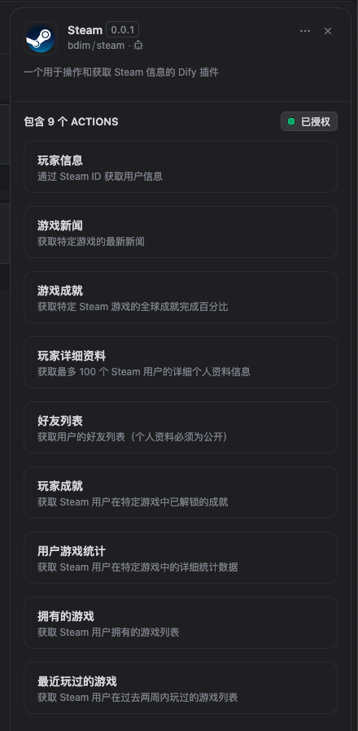

# Steam Dify 插件

[English Documentation](./README.md)

一个用于集成Steam Web API功能的Dify插件，可以查询玩家信息、游戏统计、好友列表等Steam相关数据。



## 关于Steam

Steam是全球最大的电子游戏发行平台之一，由Valve Corporation开发。它不仅是一个游戏商店，还提供社区功能、玩家资料、成就系统和游戏统计等丰富的功能。Steam Web API允许开发者访问这些数据，为用户提供更丰富的游戏体验和数据分析。

您可以访问[Steam官方网站](https://store.steampowered.com/)了解更多信息。

## 使用方法

### 安装

您可以下载[最新版本](https://github.com/bdim404/steam/releases/latest)并将其上传到Dify平台。有关详细说明，请参阅[安装和使用插件：本地文件上传](https://docs.dify.ai/plugins/quick-start/install-plugins#local-file-upload)。

### 打包（可选）

如果您想自己打包此插件，请确保已安装[dify-plugin-daemon](https://github.com/langgenius/dify-plugin-daemon/releases)，然后下载或克隆(`git clone`)此仓库。之后，您可以使用以下命令进行打包：

```
dify-plugin-daemon plugin package ./steam
```

有关更多信息，请参阅[工具插件：打包插件](https://docs.dify.ai/plugins/quick-start/develop-plugins/tool-plugin#packing-plugin)。

### 设置授权

安装插件后，您需要配置与Steam Web API的连接。

您需要提供以下凭据：

- **API密钥**：访问Steam Web API的授权密钥
- **Steam ID**：您的17位Steam ID（用于验证API密钥）

您可以从[Steam开发者网站](https://steamcommunity.com/dev/apikey)申请并获取API密钥。您需要有一个有效的Steam账户并同意Steam Web API使用条款。

在设置过程中，插件将验证您的凭据，以确保它能够成功连接到Steam API服务。

一旦授权设置完成，您就可以使用此插件与Steam API进行交互。

### 功能特点

该插件支持以下功能：

1. **玩家信息查询**：查询Steam用户的基本资料信息，包括用户名、头像、个人资料URL和在线状态等。

2. **游戏新闻获取**：获取特定游戏的最新新闻和更新公告。

3. **游戏全球成就统计**：查询游戏的全球成就完成率统计数据。

4. **玩家详细资料**：获取玩家的详细个人资料，包括真实姓名（如果公开）、账户创建时间、位置信息等。

5. **好友列表查询**：获取玩家的Steam好友列表，包括添加好友的时间和关系类型。

6. **玩家游戏成就**：查询玩家在特定游戏中已解锁的成就列表和解锁时间。

7. **游戏统计数据**：获取玩家在特定游戏中的详细统计数据，如游戏时间、得分、击杀数等游戏特定指标。

8. **已拥有游戏列表**：获取玩家拥有的所有游戏列表，包括游戏时间统计和游戏图标。

9. **最近游玩游戏**：查询玩家最近两周内游玩过的游戏列表和游戏时间。

您可以在Dify工作流或其他地方调用此插件。所有参数都有详细的注释。只需提供Steam ID或游戏AppID，并选择您需要查询的信息类型，即可获取相应结果。

## 使用场景

1. **游戏社区机器人**：创建能够查询玩家资料、成就和游戏统计的聊天机器人
2. **游戏数据分析**：分析玩家游戏时间、成就完成率等数据
3. **游戏新闻推送**：自动获取和推送特定游戏的最新新闻
4. **玩家数据仪表板**：构建展示玩家游戏库、游戏时间和成就的个性化仪表板
5. **好友活动追踪**：监控和显示好友最近的游戏活动

## 开发者必读

使用此插件时，请注意以下重要事项：

1. **API使用限制**：Steam Web API有请求频率限制，请合理使用，避免过于频繁的请求
2. **隐私设置**：只能获取设置为公开的玩家资料和游戏数据
3. **合规使用**：使用Steam API时，请遵循[Steam Web API使用条款](https://steamcommunity.com/dev/apiterms)

## 作者

**作者:** bdim  
**版本:** 0.0.1  
**类型:** 工具插件有关更多信息，请参阅[工具插件：打包插件](https://docs.dify.ai/plugins/quick-start/develop-plugins/tool-plugin#packing-plugin)。

### 设置授权

安装插件后，您需要配置与Steam Web API的连接。

您需要提供以下凭据：

- **API密钥**：访问Steam Web API的授权密钥
- **Steam ID**：您的17位Steam ID（用于验证API密钥）

您可以从[Steam开发者网站](https://steamcommunity.com/dev/apikey)申请并获取API密钥。您需要有一个有效的Steam账户并同意Steam Web API使用条款。

在设置过程中，插件将验证您的凭据，以确保它能够成功连接到Steam API服务。

一旦授权设置完成，您就可以使用此插件与Steam API进行交互。

### 功能特点

该插件支持以下功能：

1. **玩家信息查询**：查询Steam用户的基本资料信息，包括用户名、头像、个人资料URL和在线状态等。

2. **游戏新闻获取**：获取特定游戏的最新新闻和更新公告。

3. **游戏全球成就统计**：查询游戏的全球成就完成率统计数据。

4. **玩家详细资料**：获取玩家的详细个人资料，包括真实姓名（如果公开）、账户创建时间、位置信息等。

5. **好友列表查询**：获取玩家的Steam好友列表，包括添加好友的时间和关系类型。

6. **玩家游戏成就**：查询玩家在特定游戏中已解锁的成就列表和解锁时间。

7. **游戏统计数据**：获取玩家在特定游戏中的详细统计数据，如游戏时间、得分、击杀数等游戏特定指标。

8. **已拥有游戏列表**：获取玩家拥有的所有游戏列表，包括游戏时间统计和游戏图标。

9. **最近游玩游戏**：查询玩家最近两周内游玩过的游戏列表和游戏时间。

您可以在Dify工作流或其他地方调用此插件。所有参数都有详细的注释。只需提供Steam ID或游戏AppID，并选择您需要查询的信息类型，即可获取相应结果。

## 使用场景

1. **游戏社区机器人**：创建能够查询玩家资料、成就和游戏统计的聊天机器人
2. **游戏数据分析**：分析玩家游戏时间、成就完成率等数据
3. **游戏新闻推送**：自动获取和推送特定游戏的最新新闻
4. **玩家数据仪表板**：构建展示玩家游戏库、游戏时间和成就的个性化仪表板
5. **好友活动追踪**：监控和显示好友最近的游戏活动

## 开发者必读

使用此插件时，请注意以下重要事项：

1. **API使用限制**：Steam Web API有请求频率限制，请合理使用，避免过于频繁的请求
2. **隐私设置**：只能获取设置为公开的玩家资料和游戏数据
3. **合规使用**：使用Steam API时，请遵循[Steam Web API使用条款](https://steamcommunity.com/dev/apiterms)

## 作者

**作者:** bdim  
**版本:** 0.0.1  
**类型:** 工具